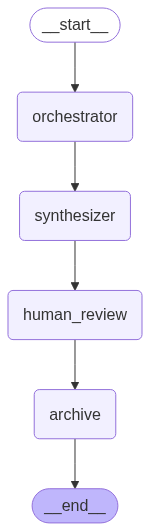

# 🚀 Automated Meeting Notes Workflow

End-to-end meeting summarization using **LangGraph**, open-source LLMs, and **LangSmith** for debugging and traceability.

---

## 📋 Overview

This project automates the process of extracting **clear, actionable meeting notes** from any transcript.  
It uses a modular LangGraph architecture to:
- **Orchestrate** the transcript into logical sections
- **Synthesize** concise summaries for each section using an LLM
- Include a **human review step** for quality and context
- **Archive final notes** for sharing or compliance
- **Trace every step** with LangSmith for debugging and transparency

---

## 🛠️ How It Works

**Workflow Steps:**
1. **Input:** Paste or upload your raw meeting transcript (multi-speaker)
2. **Orchestrator Node:** Splits the transcript into meaningful chunks
3. **Synthesizer Node:** Summarizes each section using an LLM
4. **Human Review Node:** Lets a human approve or edit summaries (CLI prompt)
5. **Archive Node:** Saves the finalized notes for reference

Each step is **traced** and visualized in your LangSmith dashboard.

---

## 📦 Setup

### 1. Clone the Repository

```
git clone https://github.com/your-username/automated-meeting-notes.git
cd automated-meeting-notes
```

### 2. Install Requirements

```
pip install -r requirements.txt
```

### 3. Configure LangSmith

Set your LangSmith API key (get one at [smith.langchain.com](https://smith.langchain.com/)):

```
export LANGSMITH_API_KEY=your-key-here
```

---

## 🚀 Usage

Run the main script:

```
python main.py
```

- Enter or paste your meeting transcript at the prompt, or replace the sample in the code.
- Review, edit, or accept the generated notes.
- Find all steps traced in your [LangSmith dashboard](https://smith.langchain.com/).

---

## 🧩 Example

**Sample Input:**
```
transcript = """
    Speaker 1: Good morning, everyone. Let's start with our Q3 project updates. 
    Speaker 2: Thanks, Speaker 1. The web app migration is almost done, but we've hit a snag with authentication—OAuth tokens are expiring too soon.
    Speaker 3: We've had several user complaints about login issues. Should we escalate to IT Security?
    Speaker 4: Yes, please loop in IT. Also, Speaker 2, can you document the token flow bug and send it to the backlog?
    Speaker 2: Absolutely, I’ll write up a ticket today. On a related note, the UI refresh for mobile is 80% complete. We need assets from the design team to finish.
    Speaker 1: Noted. Design, can you prioritize mobile assets?
    Speaker 5: We're on it. Expect initial drafts by Thursday. Also, we're revamping the color palette for better accessibility.
    Speaker 3: Speaking of accessibility, several users with screen readers had issues navigating the new dashboard.
    Speaker 4: That’s a critical blocker. Please coordinate with QA for accessibility testing.
    Speaker 2: Will do. On the infrastructure side, cloud costs spiked last week—primarily from large batch data jobs.
    Speaker 1: Can someone analyze which jobs triggered the spike?
    Speaker 3: I’ll take that action. Also, our release schedule is tight; do we have room to slip the October sprint?
    Speaker 1: Not really, but let’s flag high-risk items and communicate early.
    Speaker 5: Quick update: the marketing team requests a new landing page for the October campaign.
    Speaker 1: Please gather requirements and share a draft by next week.
    Speaker 2: One more thing: we have three open critical bugs in the API. Fixes should be ready by tomorrow.
    Speaker 4: Thanks, everyone. Let's summarize action items before we adjourn.
    Speaker 1: Sure! (1) IT Security to review authentication bug. (2) Design to deliver mobile assets and accessibility review. (3) QA to expand dashboard accessibility tests. (4) Speaker 3 to analyze cloud costs. (5) Speaker 2 to resolve API bugs. (6) Marketing draft due next week.
    Speaker 1: Anything else?
    Speaker 5: All good here.
    Speaker 2: Nothing from me.
    Speaker 3: No, thanks.
    Speaker 4: Meeting adjourned. Thanks all.
    """
```

**Sample Output:**
```
Speaker 1: Let's start with our Q3 project updates. Speaker 2: Thanks, Speaker 1. Speaker 3: We've had several user complaints about login issues. Should we escalate to IT Security?

Speakers: Can you document the token flow bug and send it to the backlog? Speaker 2: Absolutely, I’ll write up a ticket today. On a related note, the UI refresh for mobile is 80% complete.

Several users with screen readers had issues navigating the new dashboard. We're revamping the color palette for better accessibility. Expect initial drafts by Thursday.

Cloud costs spiked last week,primarily from large batch data jobs. Can someone analyze which jobs triggered the spike?

Speaker 1: Please gather requirements and share a draft by next week. Speaker 5: Quick update: the marketing team requests a new landing page for the October campaign.

We have three open critical bugs in the API. Fixes should be ready by tomorrow. Marketing draft due next week.

Speaker 1: Anything else? Speaker 2: Nothing from me. Speaker 5: All good here.

Speaker 3: No, thanks. Speaker 4: Meeting adjourned. Thanks all.

---

```

## 🖇️ Architecture




---

## 💡 Customization

- Swap in your favorite open-source LLM (e.g., [Mistral-7B](https://huggingface.co/mistralai/Mistral-7B-Instruct-v0.2))
- Integrate with Slack, email, or your internal tools
- Add advanced topic detection or action item extraction

---


---

> ### 📝 **Note: This is an *Extractive Summarization* Task**

**Abstractive summarization** means the AI generates new, concise summaries using its own words, capturing the key ideas rather than copying exact sentences from the original.

**Extractive summarization**, by contrast, selects and stitches together the most important sentences or phrases from the source text, without paraphrasing or rewording.

#### **Example:**

**Original Text:**  
"Speaker 1: Our quarterly profits rose by 20%. Speaker 2: That's a big win, but let's focus on improving customer retention going forward."

**Extractive Summary:**  
"Our quarterly profits rose by 20%. That's a big win, but let's focus on improving customer retention going forward."

**Abstractive Summary:**  
"Profits are up 20%, but the team plans to prioritize customer retention next."

---
---


## 🤝 Contributions

Pull requests and feature suggestions welcome!

---


